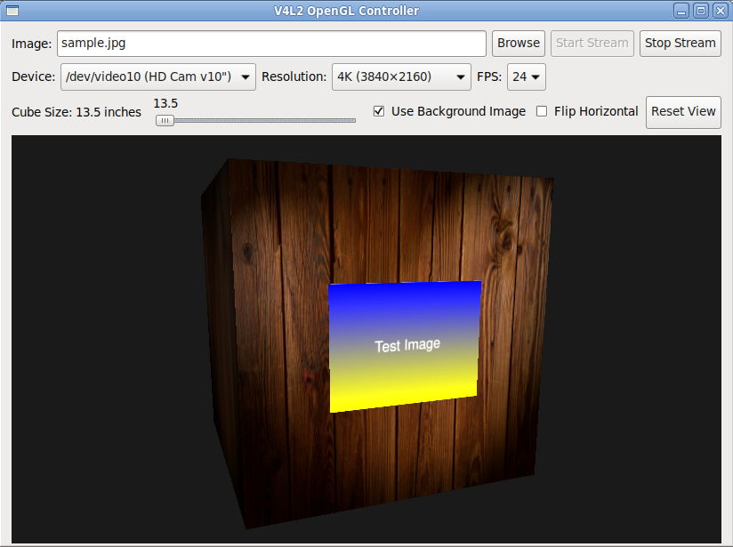

# v4l2-loopback-opengl-image

OpenGL-based virtual camera application that streams 3D-rendered scenes to v4l2loopback devices via FFmpeg.



## Description

v4l2-loopback-opengl-image creates a virtual camera by rendering a 3D scene with OpenGL and streaming it through FFmpeg to a v4l2loopback device.

### Use Case

This tool is designed for video conferencing and streaming applications where you need to display a static image (such as a document, diagram, barcode, or presentation slide) through a virtual camera device. The 3D rendering environment allows you to:

- Position and orient the image naturally in 3D space
- Adjust perspective and viewing angle interactively during calls
- Control lighting to ensure optimal visibility
- Pan and zoom to focus on specific areas
- Present professional-looking content with anti-aliased rendering

Common applications include:
- Displaying technical diagrams or schematics during remote support sessions
- Showing product images or barcodes for verification
- Presenting documents or certificates during video calls
- Creating dynamic visual presentations with adjustable perspective
- Testing camera input applications with controlled 3D-rendered content

### Features

The application provides:

- **3D Scene**: Textured cube and card objects in an interactive 3D environment
- **Camera Controls**: Mouse-driven pan, zoom, and rotation with reset view
- **Anti-Aliasing**: 8x MSAA with sample shading, hardware dithering, and Bayer matrix dithering
- **Lighting**: Interactive light source control with spherical positioning
- **Device Selection**: Dropdown menu for selecting v4l2loopback output devices
- **Image Loading**: Load and display images on the 3D card with aspect ratio preservation
- **Output Control**: Configurable horizontal flip and cube size adjustment

## Requirements

- Python 3
- GTK 3
- OpenGL 3.3+
- FFmpeg
- v4l2loopback kernel module
- Python packages: PyOpenGL, numpy, Pillow, PyGObject

## Installation

```bash
# Install system dependencies (Debian/Ubuntu)
sudo apt-get install python3-gi python3-opengl ffmpeg v4l2loopback-dkms

# Install Python packages
pip3 install numpy Pillow PyOpenGL
```

## Usage

```bash
# Load v4l2loopback module
sudo modprobe v4l2loopback devices=1 video_nr=10 card_label="Virtual Camera"

# Run the application
python3 v4l2-gl.py [/dev/videoX]
```

Optional command-line argument:
- `/dev/videoX`: Specify the v4l2loopback device to use (defaults to first available)

## Controls

### Mouse
- **Left-click + drag**: Rotate camera
- **Right-click + drag**: Rotate light source
- **Shift + left-click + drag**: Pan card position
- **Mouse wheel**: Zoom camera in/out

### UI Controls
- **Device dropdown**: Select v4l2loopback output device
- **Load Image**: Change the displayed image on the card
- **Cube Size slider**: Adjust cube dimensions (12-48 inches)
- **Flip Horizontal checkbox**: Mirror output horizontally
- **Reset View**: Restore default camera, light, and card positions

## Architecture

The application uses a multi-threaded design:
- **Main thread**: GTK UI and OpenGL rendering
- **Worker thread**: Frame timing and FFmpeg I/O
- **Communication**: Queue-based frame passing with thread-safe synchronization

Anti-aliasing stack:
1. 8x MSAA with multisample framebuffer
2. Per-sample fragment shading (GL_SAMPLE_SHADING)
3. Hardware dithering (GL_DITHER)
4. 8x8 Bayer matrix dithering in fragment shader
5. Trilinear texture filtering with mipmaps

## License

GPL-3.0